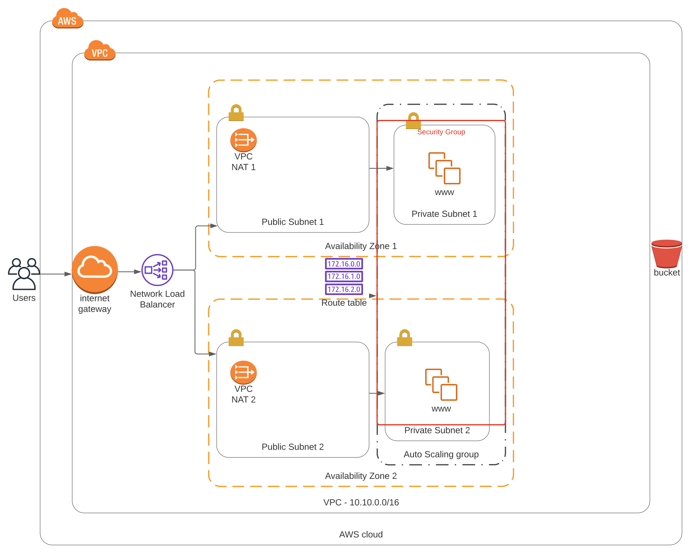

## Infrastructure as Code with AWS Cloudformation - Udagram

The following document contains instructions on how to deploy a highly available web application using AWS CloudFormation.

## Architecture Diagram

## Infrastructure Deployment

The application infrastructure consists of deploying the following stacks:
1. Network Template - Includes VPC, two pairs of public and private subnets, Internet Gateway, NAT Gateways and Routing Tables for public and private subnets with associations.
2. Application Server Template - Includes RoleforSSMAccess for secure access to the EC2 instance away from the public network, Load Balancer, web servers and corresponding autoscaling, target and security groups.

### Before running any script

`chmod +x ./script.sh`

### Create infrastructure

To create the infrastructure stack run the following commands in the same order as below:

 `./create.sh <stack-name> <template-body>.yml <parameters>.json`                                    

### Verify deployment

To check whether the web application is running, follow the web application public URL, which could be found in output exports of server-template cloud formation stack.

### Update infrastructure

To update the already existing infrastructure stack run the following command:

`./update.sh <stack-name> <template-body>.yml <parameters>.json`
